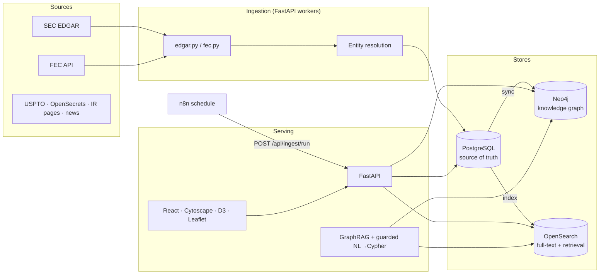

# economic-intelligence-os

An open platform that continuously ingests **US public economic data** — SEC filings, campaign finance flows, and (on the roadmap) patents, lobbying and news — resolves the entities behind them, and turns everything into a **queryable knowledge graph** with full-text search, interactive visual exploration, and an AI analysis layer.

Not a report generator: the ingested, linked, living dataset is the product. Reports, dashboards and answers are projections of it.

## Architecture



**Flow:** a scheduler (your n8n instance, or Airflow/Temporal) triggers `POST /api/ingest/run`. Ingesters pull from the sources, the entity-resolution service maps raw names onto canonical entities, PostgreSQL stores the normalized records, and two projections are derived from it: a Neo4j graph (relationships) and OpenSearch indices (search + RAG retrieval). The React console and the AI layer read through the same API.

## Stack

| Layer | Choice | Notes |
|---|---|---|
| Backend | Python · FastAPI | resilient startup, OpenAPI docs at `/docs` |
| Relational DB | PostgreSQL 16 | source of truth; every entity carries a cross-store `uid` |
| Graph DB | Neo4j 5 | idempotent MERGE-based sync from Postgres |
| Search | OpenSearch 2 | `entities` (autocomplete) + `documents` indices |
| AI layer | Claude API + GraphRAG | hybrid retrieval (OpenSearch + graph neighborhoods), cited answers, guarded NL→Cypher |
| Scheduling | n8n (or Airflow / Temporal) | calls the ingest webhook; see `workflows/n8n/` |
| Frontend | React + TypeScript + Vite | Cytoscape.js graph, D3 money flows, Leaflet map |
| Big data | Apache Spark | roadmap — swap in when per-source volume outgrows single-node ingestion |

## Quickstart

Prerequisites: Docker + Docker Compose.

```bash
cp .env.example .env
# REQUIRED: edit SEC_USER_AGENT in .env — the SEC rejects anonymous clients.
# Format: "app-name your-name your@email"

make up          # postgres + neo4j + opensearch + backend + frontend
make seed        # ingest DEFAULT_TICKERS from EDGAR + FEC, index, sync graph
```

Then open:

- **Console:** http://localhost:5173 — search an entity, tap nodes to expand the graph, ask questions
- **API docs:** http://localhost:8000/docs
- **Neo4j browser:** http://localhost:7474 (user/password from `.env`)

Ingest any additional company from the console header ("Ingest") or:

```bash
curl -X POST localhost:8000/api/companies/ingest \
  -H 'Content-Type: application/json' -d '{"ticker": "NVDA"}'
```

## API

| Endpoint | Purpose |
|---|---|
| `GET /health` | per-service status (postgres / neo4j / opensearch) |
| `GET /api/search?q=` | entities + documents full-text search |
| `GET /api/companies` · `/{id}` · `/{id}/filings` | relational reads |
| `GET /api/companies/{id}/contributions/summary` | money flow aggregation (feeds the D3 chart) |
| `POST /api/companies/ingest` | pull one ticker end-to-end |
| `GET /api/graph/neighbors?uid=` | Cytoscape-ready neighborhood |
| `GET /api/graph/path?src=&dst=` | shortest path between two entities |
| `POST /api/ask` | GraphRAG answer with `[G#]` graph facts + `[S#]` sources |
| `POST /api/ask/graph` | natural language → validated read-only Cypher |
| `POST /api/ingest/run` | full pipeline; protect with `X-API-Key` (`INGEST_API_KEY`) |

## Graph model

```
(Company)-[:FILED]->(Filing)
(Company)-[:EMPLOYER_OF]->(Person)
(Person)-[:CONTRIBUTED_TO {amount, date, sub_id}]->(Committee)
(Person)-[:OFFICER_OF {title}]->(Company)          # populated by roadmap ingesters
```

Every node's `uid` (`company:12`, `person:88`, `committee:C00401224`, `filing:0000320193-...`) is the same identifier across PostgreSQL, Neo4j and OpenSearch — the platform's connective tissue.

## Scheduling with n8n

Point a Schedule Trigger at the ingest webhook:

```
POST {BACKEND_URL}/api/ingest/run
Header: X-API-Key: <INGEST_API_KEY>
Body (optional): {"tickers": ["AAPL", "LMT"]}
```

Details and recommended settings: [`workflows/n8n/README.md`](workflows/n8n/README.md). Airflow or Temporal can drive the same endpoint when you need DAGs/retries beyond n8n.

## Data sources

| Source | Status | Auth |
|---|---|---|
| SEC EDGAR (submissions, filings) | ✅ implemented | declared `User-Agent` required |
| FEC Schedule A (contributions) | ✅ implemented | free API key (`DEMO_KEY` for dev) |
| USPTO / PatentsView | 🔜 stub | free API key |
| OpenSecrets (lobbying, revolving door) | 🔜 stub | verify current data-access model |
| Company IR pages, agencies, financial news | 🔜 planned | scraping + NER pipeline |

Full notes: [`docs/data-sources.md`](docs/data-sources.md).

## Roadmap

Full-text filing bodies in OpenSearch → richer RAG; Form 4 insider ingestion to populate `OFFICER_OF`; 13F holdings (`OWNS_STAKE_IN`); USPTO patents; news NER → event edges; Alembic migrations; authentication; Spark-based backfills; deeper GraphRAG (multi-hop retrieval planning).

---

## Türkçe Özet

Bu depo, ABD kamu ekonomik verilerini (SEC EDGAR dosyalamaları, FEC siyasi bağışları; yol haritasında USPTO, OpenSecrets, haberler) sürekli toplayıp **sorgulanabilir bir bilgi grafiğine** dönüştüren bir platform iskeletidir. PostgreSQL kayıtların ana kaynağı; Neo4j ilişki grafiği; OpenSearch tam metin arama ve RAG erişim katmanıdır. FastAPI hepsinin üzerinde tek API sunar; React konsolu Cytoscape ile grafı, D3 ile para akışlarını, Leaflet ile coğrafyayı gösterir. `POST /api/ask` GraphRAG ile atıflı cevap üretir; `POST /api/ask/graph` doğal dili korumalı (salt-okunur) Cypher'a çevirir. Zamanlama n8n'den `POST /api/ingest/run` webhook'u ile yapılır.

Çalıştırmak için: `cp .env.example .env` (içindeki `SEC_USER_AGENT` alanına kendi ad/e-postanı yaz — SEC zorunlu tutar), sonra `make up` ve `make seed`. Konsol: `http://localhost:5173`.
